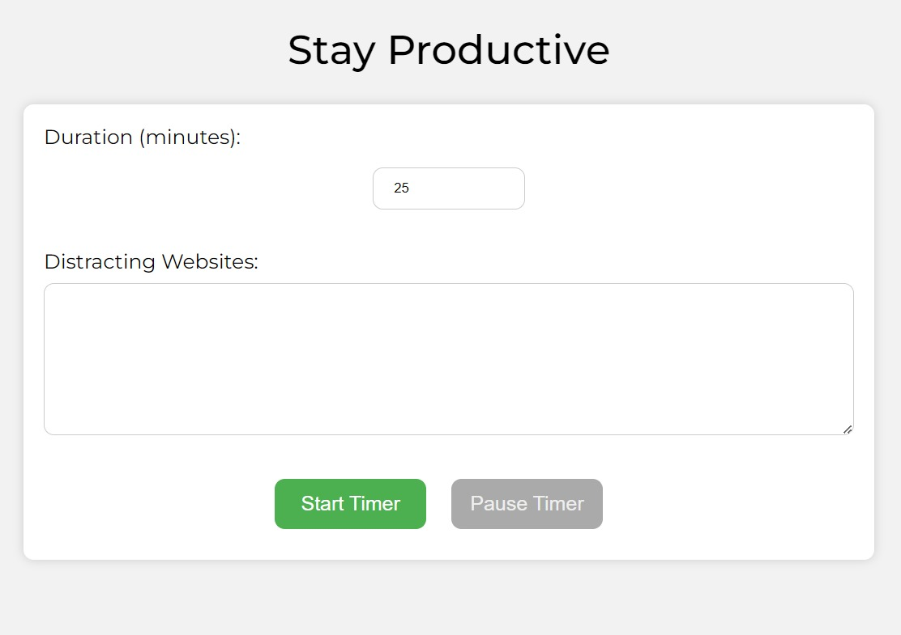
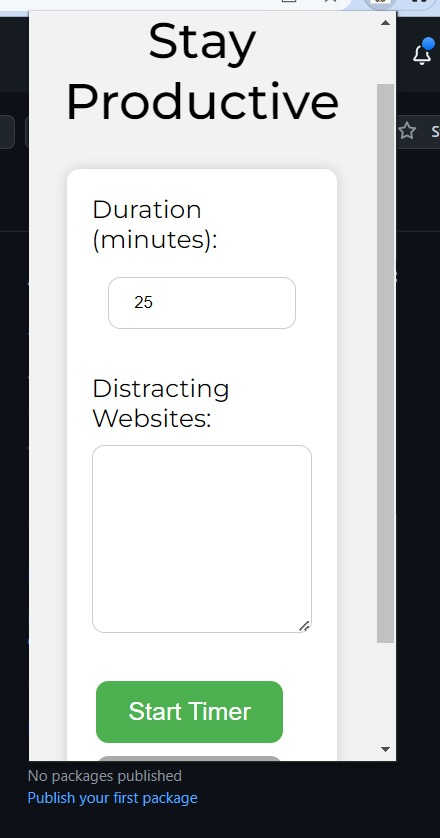
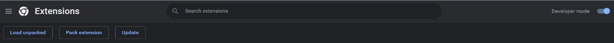

##  ***StayProductive*** is a powerful and user-friendly Chrome extension designed to help you stay focused and productive by blocking distracting websites for a set amount of time. With StayProductive, you can easily customize your browsing experience by selecting the specific websites that you want to block, or by choosing from a list of pre-selected popular sites that are known to be time-wasters.

<br />
<br />

# Preview


<br />
<br />


<br />
<br />

# Installation Guide


```js
git clone https://github.com/Yourstruggle11/StayProductive
```

```js
cd ./StayProductive
```


# Next

- Open Chrome Browser
- Go to [chrome://extensions/](chrome://extensions/)
- Toggle the top right button to enable Developer Mode.. (See the Screenshot below)

<br />

- Once Developer mode is enabled, click the **Load unpacked** button in the upper left corner.. (See the Screenshot below)

<br />

- Opload the CaptureTheScreen folder. That is all 👌


## ***Your Chrome Extension is all set***
<hr />

# You can now use this extension in the same way that you use other extensions.


## ***Feel free to copy anything, it's all yours***


## Thank You, Made with ❤️ by Souvik Sen